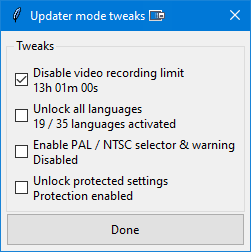
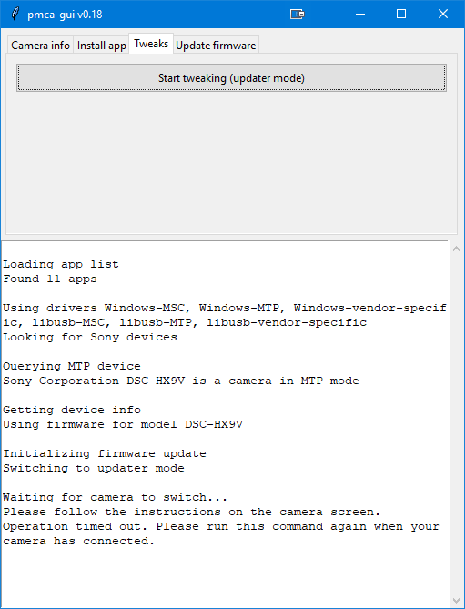

# Tweaking a Sony HX9V for infinite video recording

---

This was made possible by [ma1co @ github](https://github.com/ma1co) and his [OpenMemories-Tweak](https://github.com/ma1co/OpenMemories-Tweak) software.

---

- enable and set the USB mode in your camera to MTP-mode
- connect the Sony HX9V Cam with its propriety cable port to your computer
- download and run OpenMemories-Tweak (the GUI version v18 worked out of the box) from here: https://github.com/ma1co/Sony-PMCA-RE/releases
- switch to the _Tweaks_-tab and hit _Start tweaking (updater mode)_ and follow the instructions on your camera by simply confirming with _OK_
- change the settings as you like

The HX9V is also able to output a clean HDMI signal via its mini-HDMI port. Simply switch to the video recording mode on the mode selection wheel and connect it to a HDMI to USB capture card. . Only while zooming the zoom-bar is visible for a couple of seconds.
And for longer streams, in combination with a dummy battery, a _Low Battery Warning_ appears at around 1-2 hours, a simple restart fixes this.

All in all, I was able to get the camera for 25€ on ebay, 12€ for the [dummy battery](https://elektronik-video.de/kamera-netzteile/kamera-netzteil-fuer-sony/385/troy-kamera-netzteil-baugleich-mit-ac-ls5-ac-ls5dk-dk-1g-fuer-sony-cybershot-dsc-h3-h7-h), 5€ for an micro HDMI connector cable and 10€ for a cheap 1080p30 HDMI-USB capture card.
For around 50€ you can get a 1080p webcam with 16x optical zoom, unlimited recording in 1080p50 in a small package.
You can use it with a powerbank, a 5000mAh one should get you around 3-4 hours of recording.
